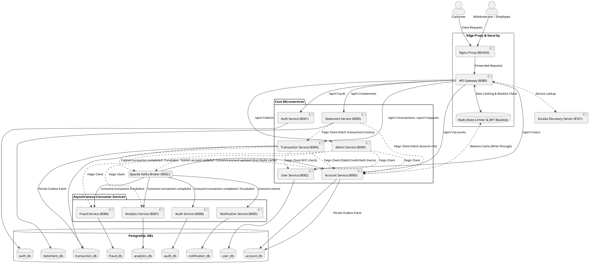

# TransactSphere Banking Platform: Architecture, Data Flows, and Database Design

TransactSphere is an enterprise-grade, event-driven banking application designed to demonstrate the robustness, scalability, and security of modern microservices. It features isolated databases, global API routing, JWT-based authentication, write-through balance caching, asynchronous message processing, and real-time rule-based fraud detection.

---

## 1. Problem Solved

Traditional monolithic banking architectures struggle with several operational and developmental bottlenecks:
* **Single Points of Failure (SPOF)**: A failure in a non-core feature (e.g., statements or feedback) can bring down core transactional capabilities (debit, credit, transfers).
* **Database Scaling Bottlenecks**: A single shared database creates high lock contention during concurrent transactions and makes horizontal scaling extremely difficult.
* **Tight Architectural Coupling**: Development teams cannot deploy service updates independently without risking backward compatibility breaks.
* **High Latency for Customers**: Blocking execution paths for high-latency side effects (such as sending emails, SMS alerts, and writing global audit logs) degrades the user experience.
* **API Inefficiencies**: Lack of centralized routing, rate limiting, and standard authentication middleware forces every service to implement its own edge security, leading to configuration drift.

**TransactSphere solves these problems** by splitting banking domains into isolated microservices that utilize a **Database-per-Service** design, dynamic service discovery, Redis-backed rate limiting, synchronous validation via Feign Clients, and asynchronous notifications, auditing, and analytics orchestrated via Apache Kafka.

---

## 2. Target Users

TransactSphere supports two distinct user personas, each with unique dashboard layouts and system interactions:

1. **Retail Banking Customers (ROLE_CUSTOMER)**
   * **Profile Management**: Maintain identity details, addresses, telephone numbers, and upload KYC (Know Your Customer) verification documents.
   * **Core Account Operations**: Open a Savings and/or a Current account, view live balances, and view transaction history.
   * **Transactional Actions**: Execute deposits, withdrawals, and instant third-party transfers.
   * **Money Requests**: Initiate peer-to-peer money requests, accept incoming requests (auto-executes a transfer), or reject request events.
   * **Statements**: Filter and generate statement reports for customizable date ranges, and download generated statements as PDF files.
   * **System Feedback**: Submit feedback directly to bank management.

2. **Bank Administrators & Employees (ROLE_ADMIN, ROLE_EMPLOYEE)**
   * **Platform Monitoring**: Access the Admin Dashboard to review platform-wide analytics (total transaction volume, account counts, aggregate balances).
   * **KYC Document Reviews**: Inspect base64-encoded customer identity documents, and approve or reject verification requests in real time.
   * **Account Security Controls**: Proactively freeze or unfreeze suspicious accounts or block entire user login credentials.
   * **Fraud Resolution**: Monitor system-generated fraud logs, trace rule violations (limits, frequency, KYC state), and mark security incidents as resolved.

---

## 3. Tech Stack

The platform is built using a modern, production-grade technology stack:

### Backend Architecture
* **Java Development Kit (JDK)**: Version 21 (leveraging modern language features and JVM optimizations).
* **Spring Boot**: Version 3.2.5 (core application framework).
* **Spring Cloud & Netflix Eureka**: 2023.0.1 (Service Registry, API Gateway, and declarative REST client routing with OpenFeign).
* **Security & Tokens**: Spring Security 6 & JSON Web Tokens (JJWT 0.11.5) for secure, stateless access controls.
* **Data Access & Mapping**: Spring Data JPA (Hibernate provider), MapStruct 1.5.5 (clean DTO-to-Entity conversions), and Lombok 1.18.32.
* **Database Drivers**: PostgreSQL JDBC Driver.
* **Caching Layer**: Spring Data Redis (caching account records and rate-limiting metrics).
* **Message Broker**: Spring Kafka (reactive and transactional consumer/producer utilities).

### Frontend Interface
* **React**: Version 18 (single-page application).
* **Build System**: Vite (lightning-fast dev server and optimized production packaging).
* **Routing**: React Router DOM 6.18.
* **HTTP Client**: Axios (configured with interceptors to inject JWT headers and redirect on session expiry).
* **Iconography**: Lucide React 0.292.
* **UI Design System**: Vanilla CSS Variables implementing a premium **glassmorphism design** with light/dark theme persistence.

### Infrastructure & Operations
* **Relational Database**: PostgreSQL 15 (Alpine Linux distributions).
* **In-Memory Store**: Redis 7 (Alpine Linux distributions).
* **Event Streaming Broker**: Apache Kafka 3.4.0 (run in KRaft mode, removing Zookeeper complexity).
* **Edge Proxy**: Nginx (handling static asset routing and mapping port 80/443 traffic to the gateway).
* **Local SMTP Testing**: MailHog (mock mail transport capture tool).
* **Container Orchestration**: Docker and Docker Compose.

---

## 4. Features & Uniqueness

TransactSphere stands out through several high-performance features and software design patterns:

* **Database-per-Service Isolation**: Downstream microservices do not share database schemas. Services communicate exclusively via APIs or event streams, preventing hidden dependency couplings.
* **Transactional Outbox Pattern**: Implemented in both `transaction-service` and `account-service` using an outbox events table. Instead of publishing directly to Kafka inside a business transaction (which could fail due to network issues), events are persisted in the local database. A background task (`OutboxPublisher`) scheduled every 1 second reads pending outbox events, pushes them to Kafka, and updates their status to `SENT`. This guarantees **at-least-once delivery** and prevents data inconsistency.
* **Write-Through Balances with Smart Invalidation**: To handle high dashboard read traffic, the `account-service` caches account balances in Redis. When transactions are processed, the cache is evicted synchronously. Furthermore, an `account.updated` event is pushed to Kafka; the `AccountEventConsumer` consumes this event to evict the corresponding balance cache across any scaled instances.
* **Thread-Safe Account Locking**: The `account-service` uses optimistic and pessimistic locking mechanisms to resolve concurrent transaction requests, preventing race conditions during simultaneous credit/debit commands.
* **Real-time 3-Tier Fraud Engine**: The `transaction-service` validates three conditions before allowing a transfer or deposit:
  1. *Rolling 24-Hour Limits*: Users cannot exceed a cumulative transfer volume of ₹100,000 in any rolling 24-hour window.
  2. *Frequency Cap*: Users cannot execute more than 5 transactions in a rolling 10-minute window.
  3. *Recipient KYC Status check*: Incoming transfers or deposits are blocked if the recipient's KYC profile is not approved.
* **Multi-Channel Notification Dispatch**: Notifications are fully decoupled. The transaction pipeline triggers a Kafka event, which is asynchronously consumed by the `notification-service` to send real-time HTML emails via SMTP (using MailHog), log mock SMS alerts, and write persistent notifications database logs.

---

## 5. Overall Architecture & Data Flow

### Request Routing Flow
1. The **React Web Client** hits the **Nginx Proxy** (Ports `80` / `443`).
2. Nginx forwards requests to the **API Gateway** (Port `8080`).
3. The Gateway's `JwtAuthenticationFilter` validates token signatures against `jwt.secret`. If valid, it extracts the `userId`, `username`, `email`, and `roles` claims and injects them as downstream headers (`X-User-Id`, `X-User-Name`, `X-User-Email`, `X-User-Roles`).
4. The Gateway checks the request IP against a Redis key and decrementing rate bucket (configured via `ipKeyResolver` and Spring Cloud Gateway's Redis rate-limiter).
5. Gateway queries the **Eureka Discovery Server** (Port `8761`) to locate an active service instance (e.g., `lb://transaction-service`) and forwards the request.

### Data Flow Patterns
* **Synchronous Inter-Service Communication**: Occurs during core debit/credit transactions. When a customer initiates a transfer, `transaction-service` calls `user-service` via Feign to verify the target user's KYC status, then calls `account-service` via Feign to update the sender and receiver balances in a single, coordinated transaction.
* **Asynchronous Event-Driven Broadcast**: Occurs immediately after a state change is committed. An outbox entry is written, which is published to Kafka. The consumer group listeners (`notification-group`, `audit-group`, `analytics-group`, `fraud-group`) process the event in parallel without blocking the client's API response.

### PlantUML Architecture Diagram

Below is the PlantUML definition mapping out the entire system topology, databases, communication paths, and messaging queues:



---

## 6. APIs Used & Internal Service Communications

All incoming external REST APIs are mapped to the API Gateway. The table below represents the core exposed routes:

### Authentication Endpoints (`/api/v1/auth`)
| HTTP Method | Resource Path | Headers Required | Description |
| :--- | :--- | :--- | :--- |
| **POST** | `/register` | *None* | Registers a new user. Default role is `CUSTOMER`. |
| **POST** | `/login` | *None* | Authenticates credentials; returns Access and Refresh JWT tokens. |
| **POST** | `/refresh` | *None* | Claims a new Access Token using a valid Refresh Token. |
| **POST** | `/logout` | `Authorization` | Blacklists the access token signature in Redis. |
| **POST** | `/forgot-password` | *None* | Performs password recovery updates. |
| **PUT** | `/users/{id}/block` | `X-User-Roles` (Admin) | Toggles active status on users. |
| **GET** | `/admin/users` | `X-User-Roles` (Admin) | Lists all user IDs and block statuses. |

### User Profile Endpoints (`/api/v1/users`)
| HTTP Method | Resource Path | Headers Required | Description |
| :--- | :--- | :--- | :--- |
| **GET** | `/profile` | `X-User-Id`, `X-User-Name` | Fetches active profile; initializes a profile record on first login. |
| **PUT** | `/profile` | `X-User-Id`, `X-User-Name` | Updates profile details and KYC document (base64). |
| **GET** | `/` | `X-User-Roles` (Staff) | Lists all customer profiles. |
| **GET** | `/{id}` | `X-User-Roles` (Staff) | Fetches a customer profile by ID. |
| **PUT** | `/{id}/kyc` | `X-User-Roles` (Staff) | Modifies the customer profile's KYC status. |

### Core Account Endpoints (`/api/v1/accounts`)
| HTTP Method | Resource Path | Headers Required | Description |
| :--- | :--- | :--- | :--- |
| **POST** | `/` | `X-User-Id` | Opens a new bank account (`SAVINGS` or `CURRENT`). |
| **GET** | `/` | `X-User-Id` | Lists all accounts owned by the calling customer. |
| **GET** | `/{accountNumber}` | `X-User-Id`, `X-User-Roles` | Fetches details for a specific account. |
| **PUT** | `/{accountNumber}/freeze` | `X-User-Roles` (Staff) | Freezes or unfreezes a single account. |
| **PUT** | `/user/{userId}/freeze` | `X-User-Roles` (Staff) | Bulk freezes or unfreezes all accounts belonging to a user. |
| **GET** | `/admin/all` | `X-User-Roles` (Staff) | Lists all bank accounts in the system. |

### Core Transaction Endpoints (`/api/v1/transactions`)
| HTTP Method | Resource Path | Headers Required | Description |
| :--- | :--- | :--- | :--- |
| **POST** | `/transfer` | `X-User-Id`, `X-User-Roles` | Initiates a transfer from source account to target account. |
| **POST** | `/deposit` | `X-User-Id`, `X-User-Roles` | Deposits funds into a specific account. |
| **POST** | `/withdraw` | `X-User-Id`, `X-User-Roles` | Withdraws funds from a specific account. |
| **GET** | `/my` | `X-User-Id` | Retrieves transaction logs for the calling user. |

### Peer-to-Peer Money Request Endpoints (`/api/v1/requests`)
| HTTP Method | Resource Path | Headers Required | Description |
| :--- | :--- | :--- | :--- |
| **POST** | `/` | `X-User-Id` | Creates a new money request targeting another user by username. |
| **GET** | `/incoming` | `X-User-Name` | Lists incoming money requests pending approval. |
| **GET** | `/outgoing` | `X-User-Id` | Lists outgoing money requests. |
| **PUT** | `/{id}/accept` | `X-User-Id` | Accepts request; triggers synchronous funds transfer. |
| **PUT** | `/{id}/reject` | `X-User-Id` | Rejects the request. |

### Administrative Aggregator Endpoints (`/api/v1/admin`)
| HTTP Method | Resource Path | Headers Required | Description |
| :--- | :--- | :--- | :--- |
| **GET** | `/stats` | `X-User-Roles` (Staff) | Compiles aggregate global platform metrics using Feign Client. |
| **PUT** | `/users/{userId}/kyc` | `X-User-Roles` (Staff) | Routes KYC status updates to the `user-service`. |
| **PUT** | `/accounts/{accountNumber}/freeze`| `X-User-Roles` (Staff) | Routes freeze commands to the `account-service`. |
| **GET** | `/fraud/logs` | `X-User-Roles` (Staff) | Queries fraud incident logs from the `fraud-service`. |
| **PUT** | `/fraud/resolve/{id}` | `X-User-Name`, `X-User-Roles` | Resolves a fraud log entry inside the `fraud-service`. |

---

## 7. Database Design & Key Entities

TransactSphere uses independent PostgreSQL databases. All entities map to distinct schemas. The section below describes the tables, keys, and schemas.

### A. Auth Service Database (`auth_db`)
#### Entity: `User` (Table: `users`)
* **id** (`BIGINT`, PK): Serial primary key.
* **username** (`VARCHAR(50)`, Unique, Indexed): User credential identification.
* **password** (`VARCHAR(255)`): BCrypt hashed string.
* **email** (`VARCHAR(100)`, Unique): Email address.
* **role** (`VARCHAR(20)`): Enum representation (`CUSTOMER`, `EMPLOYEE`, `ADMIN`).
* **is_active** (`BOOLEAN`): Block/active state flag.
* **created_at** (`TIMESTAMP`): Creation time stamp.
* **updated_at** (`TIMESTAMP`): Modification time stamp.

### B. User Service Database (`user_db`)
#### Entity: `UserProfile` (Table: `user_profiles`)
* **id** (`BIGINT`, PK): User profile ID (matches User ID in `auth_db`).
* **unique_id** (`VARCHAR(20)`, Unique, Indexed): Auto-generated unique bank customer identity.
* **username** (`VARCHAR(50)`, Unique): User login ID.
* **first_name** (`VARCHAR(50)`): Given name.
* **last_name** (`VARCHAR(50)`): Surname.
* **phone_number** (`VARCHAR(20)`): Contact phone number.
* **email** (`VARCHAR(100)`, Unique): User email address.
* **address** (`TEXT`): Customer home address details.
* **kyc_document** (`TEXT`): Base64-encoded customer identity image or PDF.
* **kyc_status** (`VARCHAR(20)`): Enum status (`PENDING`, `APPROVED`, `REJECTED`).
* **created_at** (`TIMESTAMP`): Entry timestamp.
* **updated_at** (`TIMESTAMP`): Edit timestamp.

#### Entity: `Feedback` (Table: `feedbacks`)
* **id** (`BIGINT`, PK): Serial identifier.
* **user_id** (`BIGINT`): Submitting customer ID.
* **username** (`VARCHAR(50)`): Submitting username.
* **subject** (`VARCHAR(100)`): Subject line.
* **message** (`TEXT`): Feedback body.
* **created_at** (`TIMESTAMP`): Submission timestamp.

### C. Account Service Database (`account_db`)
#### Entity: `Account` (Table: `accounts`)
* **id** (`BIGINT`, PK): Serial identifier.
* **account_number** (`VARCHAR(12)`, Unique, Indexed): 12-digit unique account number (prefix: `1000`).
* **user_id** (`BIGINT`, Indexed): Owner identifier.
* **account_type** (`VARCHAR(20)`): Account variant (`SAVINGS`, `CURRENT`).
* **balance** (`DECIMAL(15,2)`): Core balance representation.
* **is_frozen** (`BOOLEAN`): Lock state indicator.
* **created_at** (`TIMESTAMP`): Account open timestamp.
* **updated_at** (`TIMESTAMP`): Balance modification timestamp.

#### Entity: `OutboxEvent` (Table: `outbox_events`)
* **id** (`BIGINT`, PK): Serial identifier.
* **aggregate_id** (`VARCHAR(255)`): Affected entity identifier (e.g., account number).
* **event_type** (`VARCHAR(255)`): Name of Kafka target topic (`account.updated`).
* **payload** (`TEXT`): Event state serialized as JSON string.
* **status** (`VARCHAR(20)`): Outbox publishing status (`PENDING`, `SENT`).
* **created_at** (`TIMESTAMP`): Registration timestamp.

### D. Transaction Service Database (`transaction_db`)
#### Entity: `Transaction` (Table: `transactions`)
* **id** (`BIGINT`, PK): Serial database primary key.
* **transaction_id** (`VARCHAR(50)`, Unique, Indexed): UUID key exposed to user.
* **source_account_number** (`VARCHAR(12)`, Indexed): Sending account (null for deposits).
* **target_account_number** (`VARCHAR(12)`, Indexed): Receiving account (null for withdrawals).
* **amount** (`DECIMAL(15,2)`): Transaction volume.
* **transaction_type** (`VARCHAR(20)`): Enum representation (`DEPOSIT`, `WITHDRAWAL`, `TRANSFER`).
* **channel** (`VARCHAR(20)`): Processing mechanism (`ONLINE`, `ATM`, `BRANCH`).
* **status** (`VARCHAR(20)`): Processing state (`SUCCESS`, `FAILED`, `BLOCKED`).
* **description** (`VARCHAR(255)`): Transaction comment.
* **user_id** (`BIGINT`, Indexed): Executing customer ID.
* **timestamp** (`TIMESTAMP`): Transaction completion timestamp.

#### Entity: `MoneyRequest` (Table: `money_requests`)
* **id** (`BIGINT`, PK): Serial database primary key.
* **requester_account_number** (`VARCHAR(12)`): Requesting party account.
* **target_username** (`VARCHAR(50)`): Target payer username.
* **amount** (`DECIMAL(15,2)`): Requested amount.
* **description** (`VARCHAR(255)`): Request comment.
* **status** (`VARCHAR(20)`): Enum state (`PENDING`, `ACCEPTED`, `REJECTED`).
* **created_at** (`TIMESTAMP`): Request initialization timestamp.
* **updated_at** (`TIMESTAMP`): Request decision timestamp.

#### Entity: `OutboxEvent` (Table: `outbox_events`)
* Identical structure to Account Service's `OutboxEvent`. Captures `transaction.completed` and `transaction.fraudulent` event contexts.

### E. Notification Service Database (`notification_db`)
#### Entity: `NotificationLog` (Table: `notification_logs`)
* **id** (`BIGINT`, PK): Serial identifier.
* **user_id** (`BIGINT`): Targeted customer ID.
* **message** (`TEXT`): Dispatch alert content.
* **type** (`VARCHAR(20)`): Enum notification channel (`EMAIL`, `SMS`, `IN_APP`).
* **status** (`VARCHAR(255)`): Delivery state (`SENT`, `FAILED`, `PENDING`).
* **timestamp** (`TIMESTAMP`): Logging timestamp.

### F. Fraud Service Database (`fraud_db`)
#### Entity: `FraudLog` (Table: `fraud_logs`)
* **id** (`BIGINT`, PK): Serial identifier.
* **transaction_id** (`VARCHAR(50)`): Attempted transaction reference UUID.
* **source_account_number** (`VARCHAR(12)`): Attempted sending account number.
* **target_account_number** (`VARCHAR(12)`): Attempted target account number.
* **amount** (`DECIMAL(15,2)`): Transaction volume.
* **transaction_type** (`VARCHAR(20)`): Attempted transaction type.
* **channel** (`VARCHAR(20)`): Attempted channel.
* **status** (`VARCHAR(20)`): Attempted status.
* **timestamp** (`TIMESTAMP`): Log register timestamp.
* **fraud_reason** (`VARCHAR(255)`): Violated engine rule detail.
* **resolved** (`BOOLEAN`): Staff action flag.
* **resolved_at** (`TIMESTAMP`): Resolution timestamp.
* **resolved_by** (`VARCHAR(255)`): Staff user identification.

### G. Analytics Service Database (`analytics_db`)
#### Entity: `UserAnalytics` (Table: `user_analytics`)
* **user_id** (`BIGINT`, PK): Primary identifier.
* **total_volume** (`DECIMAL(15,2)`): Aggregated transactional volume.
* **total_count** (`BIGINT`): Aggregate transactional volume counts.
* **deposit_volume** (`DECIMAL(15,2)`): Total deposit volume.
* **withdrawal_volume** (`DECIMAL(15,2)`): Total withdrawal volume.
* **transfer_volume** (`DECIMAL(15,2)`): Total transfer volume.
* **last_transaction_timestamp** (`TIMESTAMP`): Timestamp of latest transaction.

### H. Audit Service Database (`audit_db`)
#### Entity: `AuditLog` (Table: `audit_logs`)
* **id** (`BIGINT`, PK): Serial identifier.
* **event_type** (`VARCHAR(255)`): Category of event captured.
* **message** (`VARCHAR(1000)`): Verbose log serialization.
* **user_id** (`BIGINT`): Related user context.
* **timestamp** (`TIMESTAMP`): System log timestamp.
* **service_name** (`VARCHAR(255)`): Originating microservice label.

### I. Statement Service Database (`statement_db`)
#### Entity: `StatementLog` (Table: `statement_logs`)
* **id** (`BIGINT`, PK): Serial database key.
* **user_id** (`BIGINT`): Related customer ID.
* **account_number** (`VARCHAR(12)`): Customer bank account number.
* **start_date** (`TIMESTAMP`): Scope start filter.
* **end_date** (`TIMESTAMP`): Scope end filter.
* **generated_at** (`TIMESTAMP`): PDF compilation timestamp.

---

## 8. Number of Microservices & Purposes

The system consists of **12 microservices** working in coordination. The following table describes their purposes and network endpoints:

| Service Name | Port | Database | Primary Purpose |
| :--- | :---: | :---: | :--- |
| **Discovery Server** | `8761` | *None* | Runs Netflix Eureka to maintain dynamic instance registry. |
| **API Gateway** | `8080` | *None* | Performs edge rate limiting and security token claims injection. |
| **Auth Service** | `8081` | `auth_db` | Manages credentials, tokens, sign-ups, blocks, and password changes. |
| **User Service** | `8082` | `user_db` | Stores profiles, user address, KYC files, and submits customer feedback. |
| **Account Service** | `8083` | `account_db` | Manages balances, handles debits and credits, and cache operations. |
| **Transaction Service** | `8084` | `transaction_db`| Checks rules, processes transfers/deposits/withdrawals, handles peer requests. |
| **Notification Service** | `8085` | `notification_db`| Consumes topics to distribute mail, log SMS, and register in-app items. |
| **Fraud Service** | `8086` | `fraud_db` | Logs security violations and manages employee resolutions. |
| **Analytics Service** | `8087` | `analytics_db` | Maintains user statistics and aggregate numbers for admin screens. |
| **Audit Service** | `8088` | `audit_db` | Provides global auditing by logging events across all services. |
| **Statement Service** | `8089` | `statement_db` | Compiles bank statement records and generates PDF files. |
| **Admin Service** | `8090` | *None* | Aggregates microservice details via Feign to feed dashboard widgets. |

---

## 9. Authentication & Security

TransactSphere uses token-based stateless security models with centralized enforcement:

```
[Client App] 
     │ (HTTPS Request with Authorization: Bearer <JWT>)
     ▼
[API Gateway] ──(Validates JWT signature & decodes payload)
     │
     ├─► If Invalid: Returns 401 Unauthorized
     ├─► If Blacklisted in Redis: Returns 401 Unauthorized
     │
     ▼ (Mutates headers: injects X-User-Id, X-User-Roles, etc.)
[Downstream Services] (e.g., account-service check @RequestHeader)
```

### JWT Architecture
* **Access Tokens**: Short-lived signatures (signed using standard HS256 HMAC-SHA encryption) that carry client identifiers, username, email, and authority lists.
* **Refresh Tokens**: Long-lived signatures used to request new access tokens on expiration, preventing frequent credential prompts.
* **Token Invalidation on Logout**: Post `/logout` calls send the token signature to **Redis** with a TTL matching the token's lifetime. The Gateway checks incoming tokens against this blacklist, blocking invalid sessions immediately.
* **Credential Protection**: The `auth-service` hashes user passwords using the BCrypt hashing algorithm before persisting them to the database.

### Role-Based Access Control (RBAC)
* Customers have `ROLE_CUSTOMER` privileges and are restricted to `/my` context mappings.
* Employees and administrators hold `ROLE_EMPLOYEE` and `ROLE_ADMIN` permissions, unlocking platform management APIs.

---

## 10. Scalability & Performance

TransactSphere scales dynamically under heavy transaction loads through several key design patterns:

* **Horizontal Scale-Out**: Any microservice registered with Eureka can be scaled to multiple instances. Gateway requests are load-balanced across active nodes.
* **Write-Through Balances in Redis**: Fetching balances from PostgreSQL during heavy traffic can create read bottlenecks. The `account-service` uses Redis caching for account lookups. Evictions are handled automatically on balance updates, ensuring write-through consistency.
* **Transactional Outbox for Event Streaming**: Writing state modifications and Kafka messages in a single transaction can cause thread blocks if the message broker is slow or offline. The Outbox pattern ensures event logs are saved to the local database, allowing the scheduler to handle message publishing asynchronously and preventing database connection pool exhaustion.
* **Database Indexes**: Databases include target indexes on frequently queried columns (`idx_account_number`, `idx_user_id`, `idx_transaction_id`), optimizing lookup performance.

---

## 11. Error Handling, Logging, & Monitoring

### Standardized Error Responses
Each Spring Boot service includes a `@RestControllerAdvice` exception handler (`GlobalExceptionHandler`). Exceptions (e.g., `InsufficientFundsException`, `AccountFrozenException`, `InvalidTokenException`) are caught and mapped to standard REST error formats:

```json
{
  "timestamp": "2026-07-18T16:45:00.123",
  "status": 400,
  "error": "Bad Request",
  "message": "Insufficient balance to transfer ₹12,000 from account 100012345678",
  "path": "/api/v1/transactions/transfer"
}
```

### Distributed Logging & Auditing
* **Local Logging**: System events are tracked locally inside container logs using the SLF4J framework.
* **Decoupled Global Auditing**: Auditing is decoupled from core banking flows. Microservices push outbox events containing event contexts to Kafka. The `audit-service` consumes these events, serializes the details, and writes them to the central `audit_db` without affecting transaction latency.

### System Monitoring
* Downstream services expose actuator health endpoints (`/actuator/health`). The API Gateway monitors service statuses to ensure traffic is routed only to active instances.

---

## 12. Limitations & Future Improvements

While TransactSphere is highly robust, several enterprise improvements can be added in future iterations:

1. **Distributed Transactions (Saga Pattern)**: Inter-service actions currently rely on Feign calls. If a balance credit succeeds in `account-service` but the transaction log fails in `transaction-service`, the system can enter an inconsistent state. Implementing an orchestration-based Saga Pattern using Kafka would support compensating transactions.
2. **Dynamic Policy Engines for Fraud Checking**: The fraud checking engine uses hard-coded thresholds (₹100,000 daily limits, 5 transactions per 10 minutes). Integrating a dynamic rules engine (such as Drools) or an AI anomaly detection service would enable real-time risk assessment.
3. **Resilience & Circuit Breakers**: Adding Resilience4j circuit breakers to Feign client interfaces would prevent cascading failures if a downstream service goes offline.
4. **Cloud Object Storage for KYC Documents**: Storing base64-encoded KYC files directly in PostgreSQL databases can cause database bloat. Moving these files to an object storage service (like AWS S3) and saving only the URL links in the database would improve scalability.
5. **Multi-Partition Kafka Clusters**: Transitioning from a single-node KRaft broker to a multi-broker, multi-partition Kafka cluster would support higher throughput and message replication in production environments.
