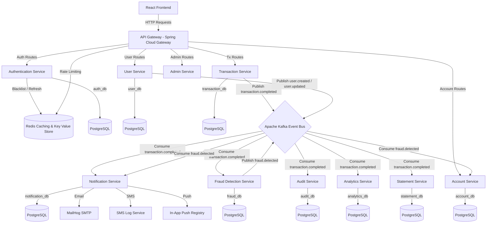

# Implementation Plan: Enterprise Banking Notification & Event System

Welcome to the project! This implementation plan outlines the architecture, database designs, messaging flows, and a phased, step-by-step roadmap to build an Event-Driven Enterprise Banking Platform from scratch. 

Since you are a fresher, each phase is designed as a learning milestone. We will build the system incrementally, explaining the architectural patterns (like Database-per-Service, Event-Driven Architecture, API Gateway, Rate Limiting, and JWT-based Stateless Auth) as we write the code.

---

## Architecture Overview

### Key Architectural Patterns
1. **Database-per-Service**: Each microservice owns its PostgreSQL database. No microservice can directly access another service's database. This prevents tight coupling and allows independent schema evolution.
2. **Event-Driven Architecture (EDA)**: The transaction processing is synchronous and fast. Once validated and stored, a `transaction.completed` event is fired to Kafka. Downstream tasks (notifications, fraud analysis, PDF generation, analytics, auditing) consume this event asynchronously, keeping the transaction endpoint highly responsive.
3. **API Gateway & Centralized JWT Auth**: The API Gateway acts as the single entry point. It validates JWT tokens, handles CORS, and routes traffic. It also uses Redis to perform API Rate Limiting to prevent Denial of Service (DoS) attacks.
4. **Redis Cache & Blacklist**: Used for blazingly fast lookups, such as keeping a blacklist of logged-out JWTs, caching frequently queried user balances, and keeping rate limit counters.

---

## Kafka Event Schema Design

Below are the key events that will be transmitted through our Kafka cluster:

| Topic Name | Producer Service | Consumer Services | Payload Details |
| :--- | :--- | :--- | :--- |
| `user.created` | Auth / User Service | Audit Service, Analytics Service | `userId`, `username`, `email`, `role`, `createdAt` |
| `transaction.completed` | Transaction Service | Notification, Fraud, Audit, Analytics, Statement | `transactionId`, `sourceAccountId`, `targetAccountId`, `amount`, `transactionType`, `channel` (UPI/NEFT/RTGS), `status`, `timestamp` |
| `fraud.detected` | Fraud Service | Notification Service, Account Service, Audit | `fraudAlertId`, `transactionId`, `accountId`, `riskScore`, `reasons`, `severity` (LOW/MEDIUM/HIGH), `timestamp` |
| `notification.sent` | Notification Service | Audit Service, Admin Service | `notificationId`, `recipient`, `type` (EMAIL/SMS/PUSH), `status`, `sentAt` |
| `notification.failed` | Notification Service | Audit Service, Admin Service | `notificationId`, `recipient`, `type`, `errorDetails`, `retryCount` |

---

## User Review Required

> [!IMPORTANT]
> **System Memory Requirements**
> Running 11 Spring Boot services simultaneously can consume between 4GB and 6GB of system RAM. 
> To make it runnable on standard developer laptops (e.g., 8GB or 16GB RAM):
> 1. We will configure very tight JVM memory constraints in the Docker Compose setup (e.g., `-XX:MaxRAMPercentage=50.0 -Xmx256m` for each service).
> 2. We will set up a Parent Maven Project (`pom.xml`) at the repository root to enable building the entire suite with one command: `mvn clean install`.
> 3. We will group services so you can run only the ones you are working on during development (e.g., Auth + Gateway + Account first, then adding Kafka & Transaction later).

> [!NOTE]
> **Free Notification Stack Integration**
> - For **Email**: We will use **MailHog**, which runs locally as an SMTP server and provides a web dashboard at `http://localhost:8025` to inspect sent emails.
> - For **SMS**: We will create a local log-based provider.
> - For **Push Notifications**: We will implement an in-app database-backed notification system that the React frontend can poll or retrieve via REST APIs, mimicking real-time deliveries.

---

## Proposed Changes & Phased Roadmap

We will divide development into **6 progressive phases**.

### Phase 1: Infrastructure Setup & Authentication
We will set up the local Docker environment containing PostgreSQL, Kafka (using KRaft to avoid needing Zookeeper), Redis, and MailHog. Then we will build the Maven parent configuration, the API Gateway, and the Auth Service.

#### [NEW] [docker-compose.infra.yml](file:///e:/Project/TransactSphere/docker/docker-compose.infra.yml)
Contains Postgres (with setup scripts for all 9 schemas), Redis, Apache Kafka, and MailHog.

#### [NEW] [pom.xml](file:///e:/Project/TransactSphere/pom.xml)
Parent Maven POM managing dependencies (Spring Boot 3.3.x, Lombok, MapStruct, Spring Security, Spring Cloud Gateway, JWT).

#### [NEW] [gateway/](file:///e:/Project/TransactSphere/gateway)
- Spring Cloud Gateway configuration.
- Redis-backed rate limiter.
- JWT verification filter.

#### [NEW] [auth-service/](file:///e:/Project/TransactSphere/auth-service)
- PostgreSQL storage for users and credentials.
- Security configurations (BCrypt, Spring Security 6).
- JWT Token Generation & Refresh token logic.
- Redis integration to blacklist logged-out tokens.

---

### Phase 2: Core Banking Services (User, Account, Transaction)
We will build the primary transactional engine of the bank.

#### [NEW] [user-service/](file:///e:/Project/TransactSphere/user-service)
- User Profiles, Address details, phone, email, and KYC status.

#### [NEW] [account-service/](file:///e:/Project/TransactSphere/account-service)
- Savings and Current Accounts.
- In-memory/Redis caching of balances.
- Balance inquiry, mini statements, and account freeze/unfreeze APIs.

#### [NEW] [transaction-service/](file:///e:/Project/TransactSphere/transaction-service)
- Transfer logic (NEFT, RTGS, UPI, Internal Transfer, Deposit, Withdrawal).
- Validations (Balance checks, transfer limits, beneficiary limits).
- Transaction records storage.
- Kafka Producer to publish transactions to `transaction.completed`.

---

### Phase 3: Consumer Services - Notification & Fraud Detection
We will connect Kafka and build the asynchronous processing consumers.

#### [NEW] [notification-service/](file:///e:/Project/TransactSphere/notification-service)
- Kafka Consumer for `transaction.completed` and `fraud.detected`.
- Template Engine (using Thymeleaf or simple String interpolation) for emails and SMS.
- SMTP Client pointing to MailHog.
- SMS and Push logs.
- Retry mechanisms with Backoff and DLQ (Dead Letter Queue) support.

#### [NEW] [fraud-service/](file:///e:/Project/TransactSphere/fraud-service)
- Real-time rule evaluation (Amount > ₹2,00,000, rapid multiple transfers, location anomalies).
- Publishes `fraud.detected` to alert users and notify Account Service to temporarily lock accounts if score is high.

---

### Phase 4: Operations & Analytics (Audit, Statement, Analytics, Admin)
We will build the back-office and auditing components of the platform.

#### [NEW] [audit-service/](file:///e:/Project/TransactSphere/audit-service)
- Consumes all topics.
- Logs a complete audit trail (IP, service, action, browser) into an immutable table.

#### [NEW] [statement-service/](file:///e:/Project/TransactSphere/statement-service)
- Accumulates transactions.
- Provides PDF generation utility to download official account statements.

#### [NEW] [analytics-service/](file:///e:/Project/TransactSphere/analytics-service)
- Tracks transaction velocities, hourly spikes, total volumes, and revenue metrics.
- Caches aggregate analytics in Redis for fast rendering on dashboards.

#### [NEW] [admin-service/](file:///e:/Project/TransactSphere/admin-service)
- Provides health indicators for Kafka, Redis, and overall cluster.
- Exposes administrative controls for system overrides.

---

### Phase 5: React Frontend Application
A premium dashboard utilizing custom React + Vite + Tailwind CSS.

#### [NEW] [frontend/](file:///e:/Project/TransactSphere/frontend)
- **Aesthetic UI**: Sleek dark mode, custom glassmorphism components, and dynamic transition states.
- **Features**:
  - Register & Login (JWT Authentication with token refresh interceptors).
  - Customer Portal: View balances, transfer funds (UPI/NEFT/RTGS), transaction lists, push alerts.
  - Admin/Employee Portal: Audit trail tables, Fraud warnings, system analytics graphs, account management controls.

---

### Phase 6: DevOps, Testing & Documentation
We will stitch the microservices together using Docker Compose, add Prometheus/Grafana monitors, write automated tests, and compile API documentation.

#### [NEW] [docker/docker-compose.yml](file:///e:/Project/TransactSphere/docker/docker-compose.yml)
Super docker-compose that starts all 11 Spring Boot services, the React frontend, and the infrastructure in a single orchestrated command.

#### [NEW] [docker/prometheus.yml](file:///e:/Project/TransactSphere/docker/prometheus.yml) & [docker/grafana/](file:///e:/Project/TransactSphere/docker/grafana)
Pre-configured dashboard to display JVM memory usage, Kafka throughput, and transaction metrics.

---

## Verification Plan

### Phase 1 Verification
1. Run `docker compose -f docker/docker-compose.infra.yml up -d` and ensure Kafka, Postgres, Redis, and MailHog are healthy.
2. Build and boot `gateway` and `auth-service`.
3. Submit a POST request to `/auth/register` and `/auth/login` to obtain a JWT.
4. Verify that calling a protected route through Gateway returns `401 Unauthorized` without a token, and `200 OK` with a valid token.
5. Verify that token logout successfully blacklists the JWT in Redis.

We will write unit and integration tests (using Mockito and Spring Boot Test) for each service as we build them.

---

## Let's Get Started!

Are you ready to proceed with Phase 1? Once you approve this plan, I will create the root directories, setup the infra Docker files, and construct the parent Maven project. We will then design the Gateway and Auth Service together.
