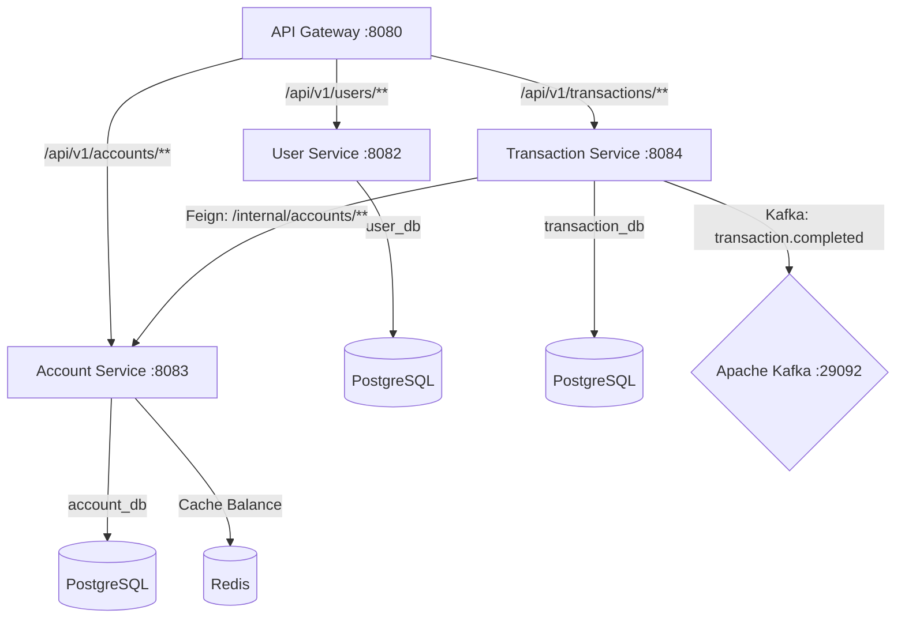

# Implementation Plan: Enterprise Banking Notification & Event System - Phase 2

This plan details the design and implementation of **Phase 2: Core Banking Services (User, Account, and Transaction Services)**. We will build the core engine of the banking platform using a Database-per-Service architecture, sync HTTP communication using OpenFeign, and event publishing via Kafka.

---

## Architecture Overview (Phase 2 Focus)



### Key Mechanisms:
1. **Edge Headers**: The API Gateway validates incoming JWTs and propagates user context downstream via headers: `X-User-Id`, `X-User-Name`, `X-User-Roles`.
2. **Synchronous Balance Updates**: The Transaction Service communicates with the Account Service synchronously using **Spring Cloud OpenFeign** to check and update account balances atomically.
3. **Asynchronous Events**: Once a transaction is successfully processed, the Transaction Service publishes a `transaction.completed` event to Apache Kafka for downstream analytics and notification processing.

---

## User Review Required

> [!IMPORTANT]
> **Internal Service Boundaries & Security**
> Downstream services (`user-service`, `account-service`, `transaction-service`) do not run traditional Spring Security login checks. Instead:
> 1. They validate authorization by checking the `X-User-Roles` and `X-User-Id` headers injected by the API Gateway.
> 2. Internal APIs (e.g., account balance check and updates) are mapped under `/internal/accounts/**` on the Account Service. These endpoints are **not** routed by the API Gateway, ensuring external requests cannot access them.

> [!NOTE]
> **Account Number Format**
> Account numbers will be generated dynamically as 12-digit strings (e.g., `100012345678`), starting with a constant branch code (`1000`) followed by 8 random digits. Uniqueness is enforced at the database level and verified during generation.

---

## Open Questions

> [!NOTE]
> **Transaction Limits and Checks**
> We propose enforcing the following default limits directly inside the Transaction Service during Phase 2:
> - Maximum transfer amount per transaction: ₹2,00,000.
> - Minimum transaction amount: ₹1.00.
> - Accounts must not be frozen to perform any transaction.
> *Please confirm if we should make these limits configurable via properties.*

---

## Proposed Changes

### [Component] Parent Module Configuration

#### [MODIFY] [pom.xml](file:///c:/Users/akars/Desktop/Java%20Stack/TransactSphere/TransactSphere/pom.xml)
- Add new submodules under `<modules>` block:
  ```xml
  <module>user-service</module>
  <module>account-service</module>
  <module>transaction-service</module>
  ```

---

### [Component] User Service (`user-service`)
Responsible for managing user KYC documents, profile information, addresses, and status flags.

#### [NEW] [pom.xml](file:///c:/Users/akars/Desktop/Java%20Stack/TransactSphere/TransactSphere/user-service/pom.xml)
- Declares dependencies: `spring-boot-starter-web`, `spring-boot-starter-data-jpa`, `postgresql` (runtime), `lombok`, MapStruct, and `spring-boot-starter-test`.

#### [NEW] [application.yml](file:///c:/Users/akars/Desktop/Java%20Stack/TransactSphere/TransactSphere/user-service/src/main/resources/application.yml)
- Sets port to `8082`.
- Configures datasource connection to `jdbc:postgresql://${DB_HOST:localhost}:5432/user_db`.
- Sets Hibernate DDL-auto to `update`.

#### [NEW] `com.transactsphere.user.UserApplication.java`
- Main class annotated with `@SpringBootApplication`.

#### [NEW] `com.transactsphere.user.model.KycStatus.java`
- Enum containing: `PENDING`, `APPROVED`, `REJECTED`.

#### [NEW] `com.transactsphere.user.model.UserProfile.java`
- JPA entity representing user profile fields: `id` (manually set from gateway `X-User-Id`), `firstName`, `lastName`, `phoneNumber`, `email`, `address`, `kycStatus`, `createdAt`, `updatedAt`.

#### [NEW] `com.transactsphere.user.repository.UserProfileRepository.java`
- JpaRepository interface for database operations.

#### [NEW] `com.transactsphere.user.dto.UserProfileResponse.java` / `UserProfileUpdateRequest.java`
- Data transfer objects for profile retrieval and update operations.

#### [NEW] `com.transactsphere.user.service.UserProfileService.java`
- Contains business logic:
  - Retrieval of profile. If profile is missing (e.g., first access after registration), auto-creates a skeleton profile using the `userId`, `username`, and `email` resolved from the gateway headers.
  - Updates profile address, name, and phone.
  - Updates KYC status (restricted to admin/employee).

#### [NEW] `com.transactsphere.user.controller.UserProfileController.java`
- REST Controller exposing:
  - `GET /api/v1/users/profile` (Gets profile of current user using `X-User-Id` header).
  - `PUT /api/v1/users/profile` (Updates profile of current user).
  - `GET /api/v1/users` (ADMIN/EMPLOYEE only - lists all profiles).
  - `GET /api/v1/users/{id}` (ADMIN/EMPLOYEE only - gets profile by ID).
  - `PUT /api/v1/users/{id}/kyc` (ADMIN/EMPLOYEE only - updates KYC status).

---

### [Component] Account Service (`account-service`)
Manages banking accounts, balance changes, and caching.

#### [NEW] [pom.xml](file:///c:/Users/akars/Desktop/Java%20Stack/TransactSphere/TransactSphere/account-service/pom.xml)
- Declares dependencies: `spring-boot-starter-web`, `spring-boot-starter-data-jpa`, `spring-boot-starter-data-redis` (for caching), `postgresql` (runtime), `lombok`, and testing tools.

#### [NEW] [application.yml](file:///c:/Users/akars/Desktop/Java%20Stack/TransactSphere/TransactSphere/account-service/src/main/resources/application.yml)
- Sets port to `8083`.
- Configures datasource connection to `jdbc:postgresql://${DB_HOST:localhost}:5432/account_db`.
- Configures Redis connection details.

#### [NEW] `com.transactsphere.account.AccountApplication.java`
- Main class annotated with `@SpringBootApplication` and `@EnableCaching`.

#### [NEW] `com.transactsphere.account.model.AccountType.java`
- Enum containing `SAVINGS` and `CURRENT`.

#### [NEW] `com.transactsphere.account.model.Account.java`
- JPA entity representing: `id` (bigint), `accountNumber` (unique string, indexed), `userId` (owner), `accountType` (enum), `balance` (BigDecimal), `isFrozen` (boolean), `createdAt`, `updatedAt`.

#### [NEW] `com.transactsphere.account.repository.AccountRepository.java`
- JpaRepository with custom queries: `findByAccountNumber`, `findByUserId`.

#### [NEW] `com.transactsphere.account.config.RedisConfig.java`
- Sets up standard RedisTemplate and CacheManager configurations.

#### [NEW] `com.transactsphere.account.service.AccountService.java`
- Implements core operations:
  - Account creation (generates a unique 12-digit account number).
  - Caches balances in Redis. Balance retrieval is cached; balance modifications invalidate or update the cache.
  - Verification: checking freeze states, validating balance sufficiency.
  - Internal transfer operations: deducting from source and adding to target inside a single `@Transactional` method.

#### [NEW] `com.transactsphere.account.controller.AccountController.java`
- External API controller:
  - `POST /api/v1/accounts` (Creates account for logged-in user).
  - `GET /api/v1/accounts` (Lists accounts for current logged-in user).
  - `GET /api/v1/accounts/{accountNumber}` (Get details of account).
  - `PUT /api/v1/accounts/{accountNumber}/freeze` (ADMIN/EMPLOYEE only - freezes/unfreezes account).

#### [NEW] `com.transactsphere.account.controller.InternalAccountController.java`
- Internal API controller (mapped to `/internal/accounts/**`):
  - `GET /internal/accounts/{accountNumber}` (Gets account details).
  - `PUT /internal/accounts/transfer` (Executes debit/credit transfer).
  - `GET /internal/accounts/user/{userId}` (Lists all account numbers owned by user).

---

### [Component] Transaction Service (`transaction-service`)
Processes transfers, deposits, and withdrawals, maintaining transaction history and publishing Kafka events.

#### [NEW] [pom.xml](file:///c:/Users/akars/Desktop/Java%20Stack/TransactSphere/TransactSphere/transaction-service/pom.xml)
- Declares dependencies: `spring-boot-starter-web`, `spring-boot-starter-data-jpa`, `spring-kafka`, `spring-cloud-starter-openfeign` (for calling account-service), `postgresql` (runtime), `lombok`, and testing tools.

#### [NEW] [application.yml](file:///c:/Users/akars/Desktop/Java%20Stack/TransactSphere/TransactSphere/transaction-service/src/main/resources/application.yml)
- Sets port to `8084`.
- Configures datasource connection to `jdbc:postgresql://${DB_HOST:localhost}:5432/transaction_db`.
- Configures Kafka bootstrap servers to `${KAFKA_BOOTSTRAP_SERVERS:localhost:29092}`.

#### [NEW] `com.transactsphere.transaction.TransactionApplication.java`
- Main class annotated with `@SpringBootApplication` and `@EnableFeignClients`.

#### [NEW] `com.transactsphere.transaction.model.Transaction.java`
- Entity fields: `id`, `transactionId` (UUID string), `sourceAccountNumber`, `targetAccountNumber`, `amount`, `transactionType` (`DEPOSIT`, `WITHDRAWAL`, `TRANSFER`), `channel` (`UPI`, `NEFT`, `RTGS`, `INTERNAL`), `status` (`PENDING`, `COMPLETED`, `FAILED`), `description`, `userId`, `timestamp`.

#### [NEW] `com.transactsphere.transaction.client.AccountClient.java`
- Feign Client targeting the `account-service` internal endpoints (`/internal/accounts/**`).

#### [NEW] `com.transactsphere.transaction.dto.TransactionEvent.java`
- Payload class sent to Kafka containing details about completed transactions.

#### [NEW] `com.transactsphere.transaction.config.KafkaProducerConfig.java`
- Configures KafkaTemplate and producer factories with JSON serializer.

#### [NEW] `com.transactsphere.transaction.service.TransactionService.java`
- Implements:
  - Validation: Verifies account ownership using Feign client, checks frozen status, and applies limits.
  - Processing:
    - Creates a transaction log marked as `PENDING`.
    - Makes a sync Feign call to update account balance in `account-service`.
    - Updates transaction log status to `COMPLETED` (or `FAILED` if the call raises an error).
    - Publishes a `TransactionEvent` to the `transaction.completed` Kafka topic.

#### [NEW] `com.transactsphere.transaction.controller.TransactionController.java`
- REST Controller exposing:
  - `POST /api/v1/transactions/transfer` (Initiates a money transfer).
  - `POST /api/v1/transactions/deposit` (Deposits money into an account).
  - `POST /api/v1/transactions/withdraw` (Withdraws money from an account).
  - `GET /api/v1/transactions/my` (Lists all transaction history for the logged-in user).

---

## Verification Plan

### Automated Tests
We will build comprehensive unit test suites using JUnit 5, Mockito, and Spring Boot Test:
- **User Service**: Test profile creation and KYC checks.
- **Account Service**: Test account creation, random generation checks, and `@Transactional` transfer mechanics.
- **Transaction Service**: Test validation logic, Feign exceptions management, and verify Kafka event publication using an embedded or container-backed Kafka test environment.
- Run all project tests:
  ```bash
  mvn clean install
  ```

### Manual Verification
1. Start the Docker infrastructure:
   ```bash
   docker compose -f docker/docker-compose.infra.yml up -d
   ```
2. Start the microservices: Gateway, Auth-Service, User-Service, Account-Service, and Transaction-Service.
3. Authenticate to obtain a valid access token.
4. Test profile retrieval and update through the Gateway (`http://localhost:8080/api/v1/users/profile`).
5. Create Savings and Current accounts through the Gateway (`http://localhost:8080/api/v1/accounts`).
6. Perform Deposits, Withdrawals, and Transfers through the Transaction Service APIs. Verify database records are updated correctly and that cached Redis balances reflect the changes.
7. Read the Kafka console consumer for `transaction.completed` to verify message payloads are correctly formatted and dispatched.
